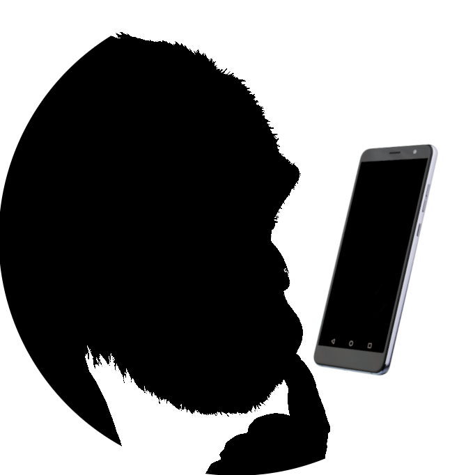
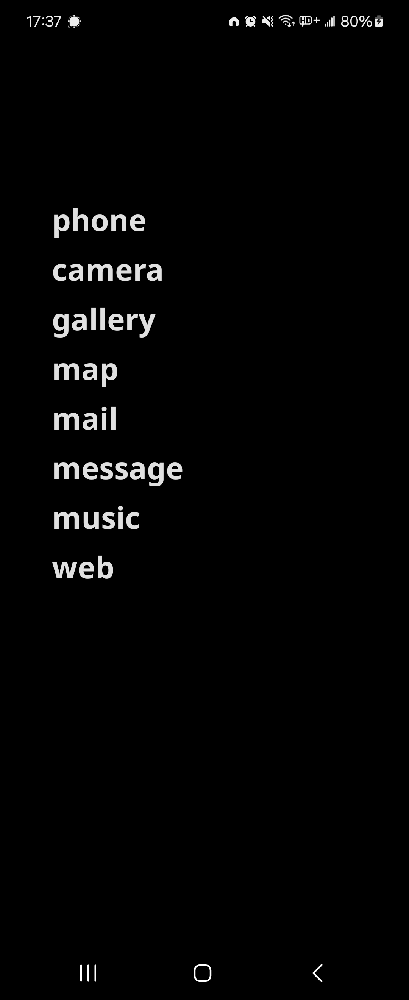

  

<h1 align="center">
  Slab Launcher
</h1>

> _A Slab from your phone_

The goal of Slab Launcher is to experience holding a black slab/monolith, that is "mind-boggling as the being itself" not fancy and colorful screen. It is not digital minimalism thingy either.

  
  

## About

Features:

- List your top apps on the home screen
- No app icons
- Customizable app titles
- Searchable drawer with all apps
- Show/Hide the notification bar on your home screen
- No wallpapers
- Multiple color themes

Differences from original repo:

- Call button replaced with browser/search
- camera button replaced with music
- bigger clock
- clock is closer to top side of phone
- removed month from date
- replaced short day name to full
- home screen apps padding size reduced
- home screen 6 apps limit increased to 12

## Project History

This project is a fork of [Unlauncher](https://github.com/jkuester/unlauncher) by [jkuester](https://github.com/jkuester) that is also fork of [SlimLauncher](https://github.com/sduduzog/slim-launcher) by [sduduzog](https://github.com/sduduzog).  
CONSIDER DOWNLOADING FROM ABOVE REPOS, THIS FORK IS BEING MAINTAINED ONLY FOR MY LIKINGS.
The contributors to those project deserve all the credit for the layout of this app.
